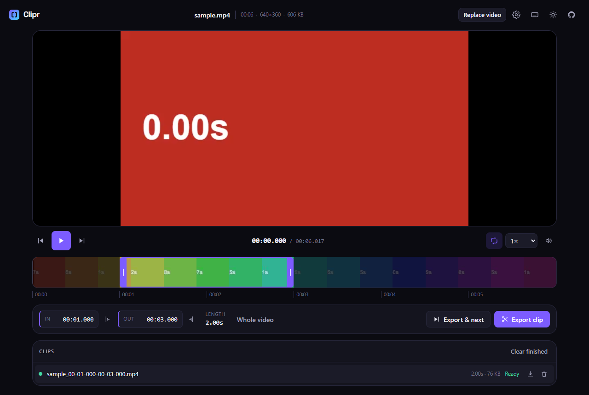

# Clipr

Take a video, pick a start and an end, get that piece as a file. That is the whole app.

[**Open it in your browser →**](https://derthert.github.io/Clipr-App/) &nbsp;·&nbsp;
[**Download for Windows →**](https://github.com/derthert/Clipr-App/releases/latest)

[](https://github.com/derthert/Clipr-App/actions/workflows/deploy.yml)
[](https://github.com/derthert/Clipr-App/releases/latest)
[](LICENSE)



There are two ways to use it, and they look and work the same:

- **The web page.** Nothing to install. Open it, drop a video on it, done. No program, no
  extension, no account, no sign in. Any current browser, any operating system.
- **The Windows app.** A normal installer with a bundled copy of ffmpeg, so cuts finish many
  times faster and huge files stop being a problem.

Either way there is no upload and no watermark. Your video is read on your own machine, so a
private recording stays private and a two gigabyte file does not have to travel anywhere first.

## Who it is for

- **People who post clips.** Pull the good thirty seconds out of a stream, a podcast or a match
  and send it straight to Discord, X or WhatsApp.
- **Teachers and presenters.** Cut the one demo you actually want to show, without opening an
  editor that wants a project file.
- **Anyone with a long recording.** Chop a lecture, an interview or a screen capture into named
  pieces in a single sitting.
- **People who cannot upload their footage.** Client material, medical recordings, anything under
  an agreement. Nothing is sent to a server, because there is no server.

If you need transitions, titles or several tracks, you want a real editor. Clipr does one cut and
does it quickly.

## How you use it

1. **Drop your video on the page.** Or click and pick one. MP4, MOV, WebM and MKV all work.
2. **Find the part you want.** Click anywhere on the filmstrip to jump there, drag the two
   handles to set the edges, or type the exact timecodes. While the video plays, <kbd>I</kbd>
   marks the start and <kbd>O</kbd> marks the end. Hold <kbd>Shift</kbd> and drag to slide the
   whole selection along without resizing it. The selection loops, so you can hear the
   boundaries.
3. **Press Export.** The clip renders in front of you and saves to your downloads.

That is the whole screen: the video, the range, and the export button. Everything else sits
behind the gear in the corner, where you set it once and forget it: MP4, GIF or MP3, three
quality steps, a size cap, and a mute switch. Those choices are remembered for next time.

### Cutting several pieces in a row

This is where Clipr earns its keep. Mark a range and press <kbd>Q</kbd>: the clip goes into the
queue and the selection jumps forward to the next stretch of the same length, ready for the next
one. Keep going and the queue works through them one by one while you carry on marking. Each
file is named after the source and its timecodes, so nothing gets overwritten and you never type
a file name.

Press <kbd>?</kbd> in the app for the full list of keys.

### Exact or lossless

Two ways to cut, and the difference matters:

- **Exact** gives you precisely the seconds you selected. The clip is re-encoded, which takes a
  little time and is the right choice almost always.
- **Lossless** copies the original video untouched, so it finishes instantly at full quality. The
  catch is that it can only start where the video already has a keyframe, so your clip may begin a
  moment before the point you marked.

Start with Exact. Switch to Lossless when the file is huge, the quality must be untouched, and a
second of slack at the front is fine.

## The Windows app

Grab it from the [latest release](https://github.com/derthert/Clipr-App/releases/latest):
`Clipr-Setup-x.y.z-x64.exe` to install, or `Clipr-x.y.z-x64-portable.exe` to run a single file
without installing. Windows will warn that the publisher is unknown, because the build is not
code signed; choose **More info → Run anyway**, or build it yourself with `npm run desktop:pack`.

Same screen, same shortcuts, two differences that matter:

- **It is much faster.** The browser version runs ffmpeg compiled to WebAssembly on a single
  core. The desktop app ships the real ffmpeg and uses every core you have. Cutting ten seconds
  out of a 1080p file on a sixteen core machine, measured both ways:

  | | Time |
  | --- | --- |
  | Windows app | 1.6 s |
  | Browser | 40.7 s |

- **Clips land next to the video.** No downloads folder, no save dialog. The clip is written into
  the same folder as the source, numbered rather than overwritten if the name is taken, and each
  row in the clips list has a button that opens the folder.

Big files and unusual codecs are also fine there, since it is the same ffmpeg you would install
by hand.

The window has no title bar of its own. The app's own top bar is the title bar, so the file name,
the settings and the window buttons all share one strip. The window opens at a fixed size and
does not resize, which is why everything on screen has a place that never moves.

## Running your own copy

Only needed if you want to host Clipr yourself or work on it. Using the app requires none of
this.

The web version is a static site, so you can open it locally or host it anywhere:

```bash
npm install
npm run dev
```

Run `npm run build` and publish the `dist` folder to put it on any host. The included GitHub
Actions workflow does exactly that for GitHub Pages on every push to `main`.

For the desktop app:

```bash
npm run desktop        # build once and open the app
npm run desktop:dev    # same window, with live reload while you edit
npm run desktop:pack   # installer and portable exe in release/
```

## Good to know

- In the browser the first export of a session takes a few extra seconds while the engine loads.
  Your browser caches it afterwards, and everything keeps working on a flaky connection because
  the cutting happens on your own machine.
- Speed depends on your machine and the clip, never on your connection. The desktop app is the
  answer for long clips and 4K.
- Your video has to be one the player can decode. An exotic codec in an MKV is turned away rather
  than shown as a black screen.
- WebM is not offered as an export format. The VP9 encoder in the browser build crashes, and
  keeping the two versions identical is worth more than one extra format. Cutting a WebM file
  losslessly works fine.

## Contributing

Issues and pull requests are welcome, including plain "this was confusing" reports. The code is
deliberately ordinary: React, TypeScript, hand written CSS, no state library. See
[CONTRIBUTING.md](CONTRIBUTING.md) for how to run it and what the house style is.

Clipr cuts video with [ffmpeg](https://ffmpeg.org/): the
[WebAssembly build](https://ffmpegwasm.netlify.app/) in the browser, and a bundled native binary
in the desktop app.

## Licence

Clipr itself is MIT, see [LICENSE](LICENSE). The desktop build ships an ffmpeg binary that is
distributed under the GPL, which covers that executable rather than this source tree.
